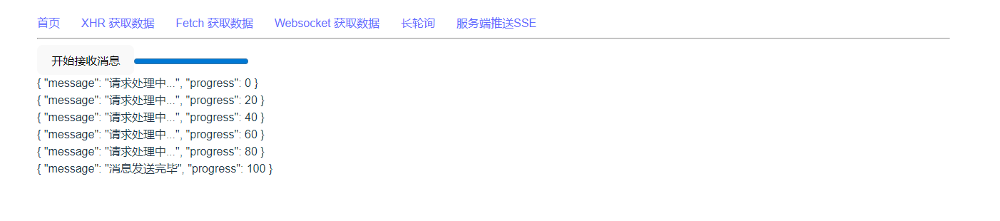

# Vue-Fetch-Demo

## 项目说明
Vue3 项目各类请求方式测试

## 项目运行

```bash
# 克隆项目
git clone https://github.com/FangyuDu/vue-fetch-demo.git

# 进入项目目录
cd vue-fetch-demo

# 安装依赖
pnpm install

# 启动服务
pnpm start

# 访问
http://localhost:3000
```

## 项目结构

```bash
├── README.md
├── .gitignore
├── .prettierrc
├── package.json
├── pnpm-lock.yaml
├── pnpm-workspace.yaml
├── workspace
│   ├── backend
│   ├── frontend

```

## 项目截图


## 计划
### 1. 基础请求
- [x] XHR/axios
- [x] fetch
- [x] websocket
- [x] 长轮询
- [x] Server-Sent Events

### 2. XHR/Axios
- [x] 传参请求
- [x] 表单传参
- [x] 上传文件
- [x] Axios Cancel
- [x] 拦截器
- [x] 覆盖默认配置
- [x] 队列请求

### 3. Fetch
- [x] 传参请求
- [x] 表单传参
- [x] 上传文件
- [x] Fetch Cancel

### 4. Websocket
- [ ] 多个连接
- [ ] 分割连接群组
- [ ] 广播
- [ ] 断线重连

### 5. 长轮询
- [ ] 传参请求

### 6. Server-Sent Events
- [ ] 传参请求

### 7. WebRTC

## 参考
- [axios](https://axios-http.com/docs/intro)
- [fetch](https://developer.mozilla.org/zh-CN/docs/Web/API/Fetch_API)
- [JAVASCRIPT.INFO - 网络请求](https://zh.javascript.info/network)
- [网络请求-Fetch](https://zh.javascript.info/fetch)
- [网络请求-WebSocket](https://zh.javascript.info/websocket)
- [网络请求-长轮询](https://zh.javascript.info/long-polling)
- [网络请求-Server Sent Events](https://zh.javascript.info/server-sent-events)
